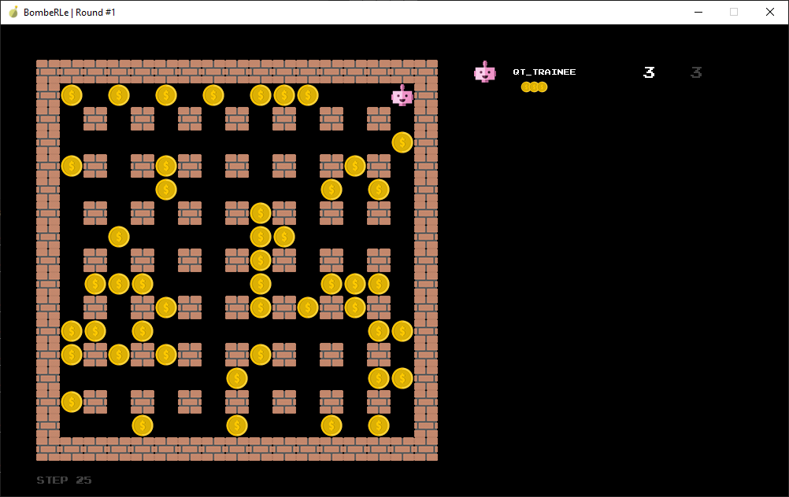

# Calculations to help decide which model to use

## State space

The board is 17x17, but the walls always are at the same position, so we can ignore them and only consider the 15x15 board, as well as ignoring the inner walls.
There are 7x7 inner walls, so the board space is 15x15 - 7x7 = 176.
On each cell, there could be nothing, a coin, a crate, one of the four agents, one of the four agents bombs with four possible timers, a explosion, and smoke which can be ignored.
Each player has a bomb cooldown timer of which coincides with the bomb timer, so we can ignore one.
The state space for nothings, coins and crates is 176^3 = 5451776.
The state space for the agents is 176 * 4 = 704, for the bombs 176 * 4 * 4 = 2816. Explosions are more difficult to calculate, but we can ignore them for now.

So the total state space is at least 5451776 * 704 * 2816 = 1.08e+13 (Ten trillion).

(Actually, the bombs can also not exist but that doesn't change the result significantly.)

### Action space

The action space is 6, as the agent can move in four directions, place a bomb, or do nothing.

### Takeaways 1

The state space is huge, so without reducing it, we can't use a value-based RL method and need to instead use a policy-based method.

## Reducing the state space

We can reduce the state space by only considering the local area around the agent, as this is the only area that is relevant to the agent.

### State space of a local area

A local area should be at least 7x7 since the explosion of a bomb can reach 3 cells in each direction. Technically a 9x9 area would be needed to not get blind spots. In a 7x7 area, there are always 12 cells that are walls, and the center is always the agent, so the board size is always 7x7 - 12 - 1 = 36 or less.
On each of these cells, there could be nothing, a coin, a crate, one of the other three agents, one of the four agents bombs with four possible timers, a explosion with two timers, and smoke which can be ignored. So an upper bound for the state space is 36^3 * 3 * 37 * 4 * 37 = 7.66e+8 (hundred million), not considering the explosions.

### Further reducing the state space

If we split the state space into multiple models, we can reduce the state space further. So if we have a model for collecting coins and one for pvp, the first model has a state space of 36^3 = 46656 and the second one of 36^2 * 3 * 37 * 4 * 37 = 21290688 not considering explosions.

### Takeaways 2

The state space is still too large for a value-based RL method, so we need to use a policy-based method. A model for collecting coins would have a manageable state space, but a model for pvp would not. If there are no other agents nearby, a coin-collecting model could be better.