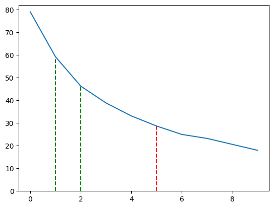

# Determining the model Size for the MCTS

## Model Size

### Input

variable, currently 6x6x7

### Convolutional Block

- 1 conv layer
- 1 batch norm layer
- 1 relu layer

### N Residual Blocks, currently 5

- 1 conv layer
- 1 batch norm layer
- 1 relu layer
- 1 conv layer
- 1 batch norm layer
- 1 residual connection
- 1 relu layer

### Output

#### Value Head

- 1 conv layer
- 1 batch norm layer
- 1 relu layer
- 1 dense layer
- tanh activation
- 1 output

#### Policy Head

- 1 conv layer
- 1 batch norm layer
- 1 relu layer
- 1 dense layer
- softmax activation
- 7 outputs

## What to reduce

The MCTS takes time both to evaluate the model and to update the state.
Lets test how much the model evaluation takes time.
Both the expand and the get_value functions are called to evaluate a position.

### Test

Currently half of the time is spent in the model evaluation. Therefore reducing the model size won't be effective if we don't also reduce the state explorer.

### Further testing

The first results were achieved by just using a primitive time() measurement. Since spending half of the time in the model evaluation is a lot, we decided to retest it with cProfile [Here](profile_mcts.ipynb).
cProfile showed that of the 0.405 seconds spent in the mcts, 0.357 seconds were spent in the model evaluation. Therefore reducing the model size is the most effective way to reduce the time spent in the mcts.

### Using models with different amount of Residual Blocks.

We tested how many steps the MCTS can make in 0.4 seconds with different amount of residual blocks [Here](profile_mcts_different_model_sizes.ipynb). The results are shown in the table below.

| Residual Blocks | Steps (average over 20) |
| --------------- | ----------------------- |
| 0               | 316.15                  |
| 1               | 236.75                  |
| 2               | 185.0                   |
| 3               | 155.3                   |
| 4               | 132.45                  |
| 5               | 114.6                   |
| 6               | 99.8                    |
| 7               | 92.75                   |
| 8               | 82.25                   |
| 9               | 71.75                   |

We can see that using 5 residual blocks is perhaps too much.

The amount of positions we can evaluate per 0.1 seconds:

### Branching Factor

An agent can choose one of 6 actions, we have 4 agents, so the branching factor is 6^4 = 1296. We can't come close to exploring all of these states. However, when the other agents are far away they needn't be considered. this means the branching factor could be 6, 36, 216 or 1296. For a branching factor of 6 for a depth of ~3 (6^3 = 216). Since a lot of states are not worth exploring, and we further reduce the amount of states we explore by using the value head of the model, we can probably handle a branching factor of 36 or maybe even 216.

### Model Size

Having 5 residual blocks is too much. We can double the amount of states we can explore by using 1 residual block. This will decrease the performance of the model, but increase the amount of states we can explore and decrease training time.

### Conclusion

We will use 1 residual block for the model.

## Further reduction

The 