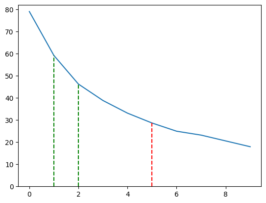

# Training

The initial DQNs were trained during the game loop after the end of each round. However, this resulted in the highly correlated data, which is not ideal for training a neural network. To combat this, we instead stored the play data in a file and trained the DQN on this data later. This approach also allowed us to train on other data sources, such as games from prior agents or synthetic data from the rule-based agent.

The training was done on Google Colab, where the training data was randomly sampled, and the DQN was trained on this data.

## Experiments and Results

The only agent that provided decent results on the standard scenario was the MCTS agent since the DQN agent would get stuck due to its lack of long-distance vision and the Q-table (TODO: reason). Therefore, we did not compare the different agents against each other. We did, however, run experiments for hyperparameter tuning.

The first experiment was to find the best number of residual blocks for the DQN. We tested the DQN with 0-10 residual blocks. We evaluated how may game states the DQN could explore in 0.4 seconds. The results are shown in the table below.

| Residual Blocks | Steps (average over 20) |
| --------------- | ----------------------- |
| 0               | 316.15                  |
| 1               | 236.75                  |
| 2               | 185.0                   |
| 3               | 155.3                   |
| 4               | 132.45                  |
| 5               | 114.6                   |
| 6               | 99.8                    |
| 7               | 92.75                   |
| 8               | 82.25                   |
| 9               | 71.75                   |

Our initial guess of five residual blocks proved too many, and we used one in the final model. The model with one residual block can explore around 240 game states in 0.4 seconds, more than $6^3 = 216$. Since the agent can take six possible actions, this is a reasonable amount of states to explore.

The second experiment was to compare different possible reward functions for the DQN.
