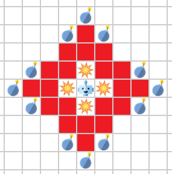

# Methods

## DQN

The Deep Q-Network (DQN) approach was chosen due to the large state space and complex dynamics of the game. By using a DQN, feature selection and engineering are unnecessary, as the neural network can learn the features and their importance by itself. This theoretically allows the DQN to outperform other approaches. However, training is computationally expensive, and local minima can be a problem. This section will describe the challenges and the implementation of the DQN approach.

One of the main challenges to the DQN approach is the large state space. With 176 non-wall spaces which can be occupied by at least crates, coins, players, bombs, and explosions (some with multiple states), the state space is cumbersomely large. While we first tried to use a one-hot encoding of the state space, this did not provide any results. We decided to use a state space centered around the player, initially with a radius of 3. This worked for the coin heaven scenario, but training again took a long time for the crate scenario. To further reduce the state space, we decided on a shape that focuses on where the player can be hit from.

(TODO: red, bombs, explosions)

As shown in the figure above, we only consider 36 spaces around the player with this method. This is incidentally also a square number, which was useful so that we could easily use convolutional layers in the neural network. We mapped the state space to a 6x6 grid while keeping neighboring spaces as neighbors in the grid.

The DQN used two convolutional layers followed by a dense layer and the output layer. The output layer had six nodes, one for each action. The DQN was trained using the Adam optimizer and the mean squared error loss function.

Since the MCTS approach succeeded this approach, we made further changes to the DQN so that it can be used in the MCTS. We changed the output to have two separate Heads, a Value Head, and a Policy Head. The Value Head outputs a single value, which is the expected reward of the state. The Policy Head outputs the prior of each action.

We also changed the other structure of the neural network. First, we used a convolutional block, then n residual blocks, and finally, the two heads. The convolutional block consisted of one convolutional layer, a batch normalization layer, and a ReLU activation function. The residual blocks consisted of two convolutional layers, each followed by a batch normalization layer and a ReLU activation function. Before the second ReLU activation function, we added a skip connection. The output of the last residual block was fed into the two heads. The Policy Head used a convolutional layer with a kernel size of 1x1 with batch normalization and a ReLU layer to reduce the number of channels and then a dense layer with a softmax activation function. The Value Head used a convolutional layer with a kernel size 1x1, batch normalization, and ReLU layers, and then a dense layer with the tanh activation function.

This final structure was first trained using the training data from prior DQN training. Then, the DQN was trained using the MCTS. The DQN was used to predict the value of the state and the prior of each action. The MCTS then used these predictions to guide the search. The DQN was then trained using the MCTS results.

## MCTS

The Monte Carlo Tree Search (MCTS) approach was chosen for its success in other games with high branching factors, precisely AlphaGo's success in Go.

In our implementation, each MCTS node represents a game state. The root node is the current game state, and the children of each node are the possible game states that can be reached by taking an action. The MCTS algorithm consists of four steps: selection, expansion, simulation, and backpropagation, as described in the background section.

While the classical approach to MCTS uses a rollout to evaluate the game state, we used a different approach. We used the DQN to evaluate the game state. The DQN outputs the value of the state and the prior of each action. The value of the state is used to backpropagate the result of the simulation, and the prior of each action is used to guide the selection of the next node. This method was done instead of rollouts because updating the game state is too expensive.

After running some experiments, we found that the MCTS state evaluation was still too slow on the CPU, so we reduced the state space size to 3x4 with seven layers for the different objects and the number of residual blocks. This is possible since the MCTS will capture the danger of further away bombs instead of having the danger captured by the DQN.

For the same reason, we ignore other agents, as if they always take the wait action. This is a simplification, but it allows us to evaluate more states faster and still provides good results in most cases.

The CPU and time restrictions were bigger problems than we anticipated. If the algorithm is run on the GPU, we could improve both the evaluation of the state and the number of states evaluated. Also, the agents could be made to always take their best action during the simulation, which would make the simulation more accurate. We also considered using the Q-table to select the other agent's actions, but since the feature extraction of the Q-table is still somewhat expensive, we decided against it.

Since the MCTS approach was successful at the PvP challenge, this approach was used in the final submission.